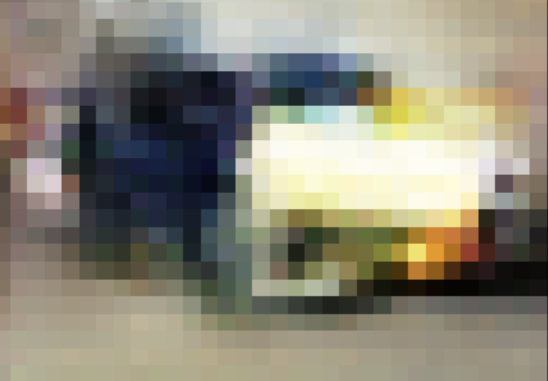

# DCGAN Implementation

DCGAN uses convolutional and convolutional-transpose layers in the generator and discriminator, respectively. The input image is of dimensions 32x32x3. The output image is also a 32x32x3 image.

The implementation was done on Google colab. Images were downloaded on to google drive and subsequently used in the notebook. 

Refer  ``` Training_code.ipynb``` for the training code .ipynb file.

Refer ```training_code.py``` for the training code .py file.

All code in this reposiroty is based on PEP-8 standards(Important for contributing to the repo).


# Generated Result(32x32 Image)



## Install Requirements:
For installing the requirements for this software, please run the following: 

 ```
 pip install -r requirements.txt
 ```
  

## Dataset
https://www.kaggle.com/datasets/jessicali9530/stanford-cars-dataset